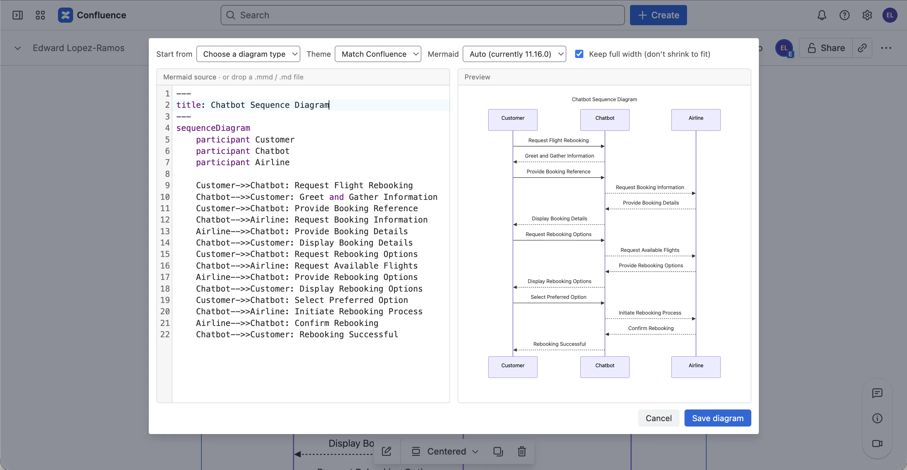
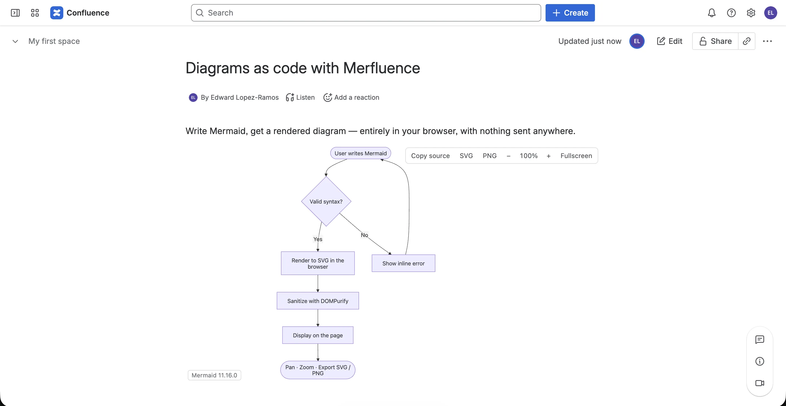
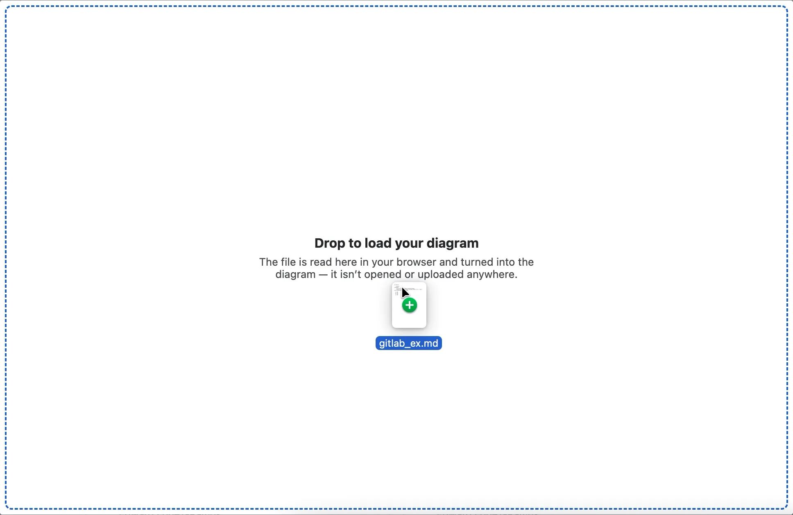

# Merfluence

> Diagrams as code for Confluence Cloud. Write [Mermaid](https://mermaid.js.org/), get a rendered diagram — entirely in your browser, with nothing sent anywhere.

[](LICENSE)
[](https://scorecard.dev/viewer/?uri=github.com/edlopez000/merfluence)




Merfluence is a free, open-source Confluence Cloud macro, built on [Atlassian Forge](https://developer.atlassian.com/platform/forge/), that renders Mermaid diagrams client-side. Diagram source lives in the page, and the rendering happens in the reader's browser. The app has no backend and requests no data-access permissions, so your diagrams never leave Atlassian — or reach us.

## Highlights

- **Private by design** — no API scopes, no external network access, no backend. The only permission requested is inline styles, which Mermaid needs to style its SVG.
- **Client-side rendering** — diagrams are generated with Mermaid and sanitized with DOMPurify before display.
- **Fast on large pages** — rendered diagrams are cached in the macro, and uncached diagrams render lazily as they scroll into view.
- **Version-stable** — pin a Mermaid major version per diagram, so existing diagrams don't break when Mermaid ships changes.
- **Free and open source** — Apache 2.0 licensed, with public source so the privacy claims are verifiable.

## Features

- All major Mermaid diagram types — flowcharts, sequence, class, state, entity-relationship, Gantt, pie, mindmap, timeline, user journey, Git graph, quadrant, XY, Sankey, C4, block, kanban, architecture, and more, each with a starter template
- A live editor with syntax highlighting, starter templates, and inline error reporting
- Drag and drop a `.mmd` file, or a Markdown file containing a ` ```mermaid ` block, straight onto the editor
- Automatic light/dark theming that follows Confluence
- A per-diagram display size (Small, Medium, or Large), or the diagram's natural size
- Pan, zoom, and fullscreen navigation, with export to SVG or PNG
- Copy the source from any rendered diagram

## Installation

### From the Atlassian Marketplace

Install Merfluence from its Marketplace listing. Then, on any Confluence page, type `/mermaid` (or `/merfluence`) and insert the macro.

### From source

See [Development](#development) to build and deploy your own instance.

## Usage

1. On a Confluence page, type `/mermaid` and insert the **Merfluence** macro.
2. Write Mermaid in the editor, start from a template, or drag in a `.mmd`/Markdown file — the preview updates as you type.
3. Optionally set the display size, theme, or pinned Mermaid version, then **Save diagram**.
4. Readers see the rendered diagram with pan, zoom, fullscreen, and SVG/PNG export.



## Privacy & security

The manifest is the product:

```yaml
permissions:
  content:
    styles:
      - 'unsafe-inline'
```

- **No `scopes`** — the app cannot read any page through the Confluence REST API.
- **No `external`** — the app cannot contact any host outside Atlassian.
- **No `function`** — there is no backend; no handler exists that could receive a diagram, let alone forward it.



Diagram source is stored as macro configuration in the page's own body and rendered to SVG by JavaScript in the reader's browser. The single declared permission — inline styles — is required only because Mermaid writes `style="…"` attributes onto the SVG it generates. Styles only; never scripts, never `unsafe-eval`.

Because macro configuration can be authored by anyone who can edit a page and is rendered for everyone who can read it, all diagram input is treated as untrusted. Three independent layers protect readers:

- `securityLevel: 'strict'` — Mermaid `click` directives parse but stay inert.
- `htmlLabels: false` — no `<foreignObject>`, so labels cannot inject HTML.
- **DOMPurify** sanitizes every rendered SVG, including cached SVG re-checked on read.

The three are independent; any one of them failing should not open a hole.

## How it works

**Rendering and caching.** Rendering is deterministic for a given source, version, theme, and width setting, so the editor renders each diagram to SVG once on save — for both light and dark — and stores the result in the macro's configuration. A reader with a cache hit displays that SVG and loads no Mermaid at all. On a cache miss, rendering is deferred behind an `IntersectionObserver` until the macro scrolls into view, so a long page never downloads the renderer for diagrams below the fold.

**Bundle size.** Mermaid is large, and every macro instance is its own iframe. Merfluence keeps this in check three ways: cached diagrams load no renderer; uncached diagrams load it lazily on scroll; and Mermaid's `mermaid.core` build lazy-loads each diagram type and layout engine on demand. In practice, a page of plain flowcharts downloads roughly 850 KB and defers about 2.3 MB of heavier libraries (Cytoscape, KaTeX, ELK) that load only when a diagram actually needs them. Build assets are content-hashed and served from the Forge CDN with a long-lived, immutable cache policy, so each chunk is fetched once and reused across iframes and reloads.

**Version currency.** Mermaid ships breaking changes across major versions, so every diagram carries a version setting: `auto` tracks the current release, or a diagram can pin `11` or `10`. Each major is a separate dynamic import, so a page never downloads a version it doesn't use. A regression corpus (`test/parse.test.js`) runs every fixture through `mermaid.parse()` on each dependency bump to confirm that previously valid syntax still parses — the failure that actually matters — and CI gates version upgrades on that corpus. The exact Mermaid version that rendered a diagram is shown on hover, so bug reports arrive with a version attached.

## Limitations

**Word export.** Forge macros require an `adfExport` function to appear in Word exports, but adding one currently overrides the high-fidelity PDF renderer with the same limited output ([CONFCLOUD-83083](https://jira.atlassian.com/browse/CONFCLOUD-83083)). Rather than degrade the common case to serve the rare one, Merfluence ships no exporter; use the toolbar's SVG or PNG download instead.

## Development

```bash
npm install
forge register                        # writes your app id into manifest.yml
npm run build                         # builds both bundles into static/{view,config}/dist
forge deploy -e development
forge install --product confluence -e development --site your-site.atlassian.net
```

- `npm test` runs both test projects: the unit suite (jsdom, including the
  parse-regression corpus) and a real-Chromium browser suite covering the full
  render pipeline and an XSS end-to-end check. `npm run test:unit` and
  `npm run test:browser` run one at a time; `npm run test:coverage` adds the
  coverage gate CI enforces.
- `forge lint` validates the manifest.
- `forge tunnel` gives live reload against your development site.

Project layout:

```
manifest.yml            Forge descriptor — declares the single inline-styles permission
src/lib/
  render.js             Mermaid init, parse, render, and DOMPurify sanitize
  mermaid-registry.js   Lazy per-major loading and version pinning
  host.js               @forge/bridge wrappers and theme resolution
  cache.js              SVG cache shape and size gate
  mermaid-file.js       Extract Mermaid from dropped .mmd / Markdown files
  templates.js          Starter diagrams
  sizing.js             Diagram height presets (Natural/S/M/L)
  zoom.js               Cursor- and centre-anchored zoom math
src/view/               The macro as readers see it
src/config/             The editor: CodeMirror (mermaid-lang.js), live preview, drag-and-drop
test/                   Unit suite and parse-regression fixtures
test/browser/           Chromium suite: render pipeline and XSS end-to-end
```

## Contributing

Issues and pull requests are welcome — see [CONTRIBUTING.md](CONTRIBUTING.md) for commit conventions and the release process. New diagram types should ship with a fixture in `test/fixtures/`, and the test suite must stay green (`npm test`) before changes are merged.

## License

[Apache 2.0](LICENSE) © Edward Lopez-Ramos.
